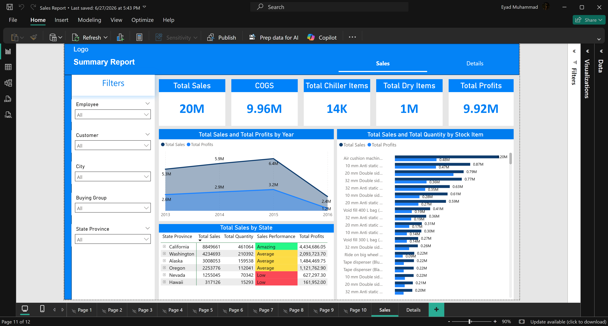
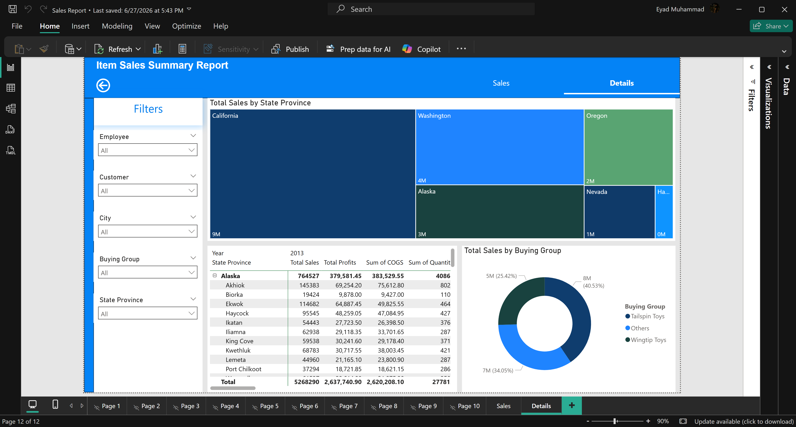
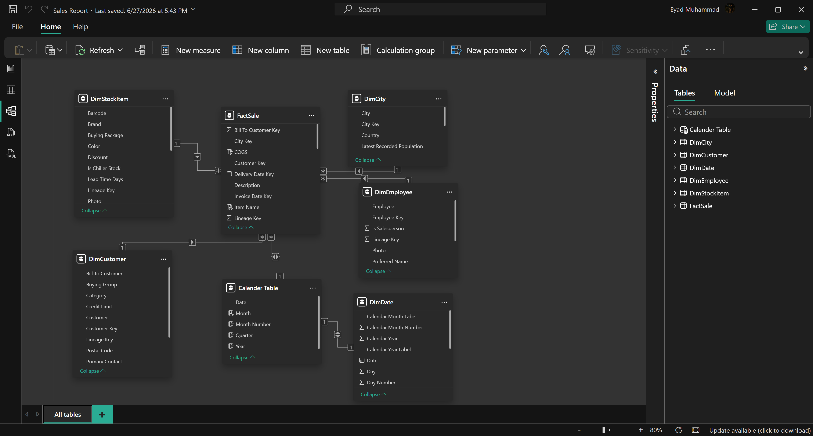

# 📊 Sales Analytics Dashboard | Power BI

## Overview
This project is an end-to-end **Sales Analytics Dashboard** built with **Power BI** to transform raw sales data into meaningful business insights. The solution follows Business Intelligence best practices by implementing a **Star Schema** data model, reusable **DAX** measures, and interactive dashboards for sales analysis and decision-making.

## Features
- Star Schema data model
- Fact and Dimension tables with optimized relationships
- Calendar table for time intelligence
- Reusable DAX measures and KPIs
- Interactive dashboards with slicers and cross-filtering
- Drill-through pages for detailed analysis
- Sales, Profit, COGS, and Quantity analysis

## Key Insights
- Analyzed **$20M+** in total sales and **$9.9M+** in profit.
- Identified top-performing states, customers, buying groups, and employees.
- Applied Pareto analysis to highlight products generating the majority of sales.
- Analyzed sales trends over time using time-intelligence techniques.
- Enabled interactive exploration of business performance through dynamic filtering.

## Technologies Used
- Power BI
- DAX
- Power Query
- Data Modeling (Star Schema)
- Data Cleaning & Transformation
- KPI Development
- Business Intelligence

## Dashboard Preview

## Author

**Eyad Muhammad**

- LinkedIn: *(https://linkedin.com/in/ed-mo1)*
- GitHub: *(https://github.com/Ed-Mo1)*

